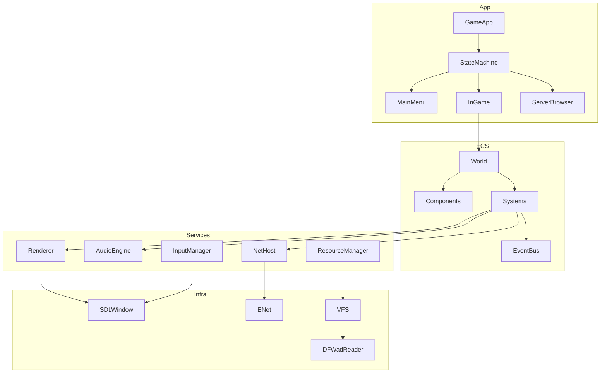

# 02 — Целевая архитектура C++ (OOP + ECS)

## 1. Принципы проектирования

### 1.1 Разделение OOP и ECS

| Парадigm | Где применяется | Примеры |
|----------|-----------------|---------|
| **ECS** | Runtime game entities, simulation | Player, Monster, Projectile, Item, Panel state |
| **OOP (Services)** | Subsystems без entity lifecycle | Renderer, AudioEngine, NetHost, ResourceManager |
| **Data-oriented** | Hot paths | Spatial grid, particle pools, network buffers |
| **Data-driven** | Контент | mapdef schema, weapon tables, monster defs |

**Правило:** ECS для всего, что spawn/despawn/update каждый тик. OOP-сервисы для инфраструктуры.

### 1.2 Слои (Clean Architecture)

```
┌─────────────────────────────────────────────────────────┐
│                    Application Layer                     │
│  GameApp, MainMenuState, InGameState, ServerApp         │
├─────────────────────────────────────────────────────────┤
│                    Game Logic Layer                      │
│  ECS World, Systems, Components, Events                 │
├─────────────────────────────────────────────────────────┤
│                    Domain Layer                          │
│  MapDef, Physics, CombatRules, GameModes               │
├─────────────────────────────────────────────────────────┤
│                    Infrastructure Layer                  │
│  Platform (SDL), Render, Audio, Net, VFS, Assets        │
└─────────────────────────────────────────────────────────┘
```

Зависимости направлены **только вниз**. Game logic не знает про OpenGL/ENet напрямую — только через interfaces.

---

## 2. Структура проекта

```
Doom2D-Forever/
├── cmake/                    # CMake modules, toolchains
├── assets/
│   ├── legacy/             # WAD, dfz — исходники для import
│   └── content/            # Сгенерировано d2df-import (runtime)
├── docs/
├── tools/
│   ├── d2df-import/        # Legacy WAD/dfz → content/
│   ├── d2df-wad-ls/        # Inspect legacy archives
│   ├── d2df-map-import/    # Legacy map → JSON map
│   └── mapgen/             # mapdef.txt codegen
├── tests/
│   ├── unit/
│   ├── integration/
│   └── golden/               # Byte-level format tests
├── third_party/              # ENet, stb, miniz, Catch2...
└── src/
    ├── d2df/                 # Main library
    │   ├── app/              # Application entry, states
    │   ├── core/             # ECS world, events, timers
    │   ├── domain/           # MapDef, game rules, constants
    │   ├── ecs/
    │   │   ├── components/   # Pure data components
    │   │   └── systems/      # Logic systems
    │   ├── platform/         # SDL window, input, filesystem
    │   ├── render/           # Renderer, shaders, sprites
    │   ├── audio/            # Sound engine
    │   ├── net/              # ENet wrapper, protocol
│   ├── resources/        # AssetDatabase (modern content/ only)
│   └── ui/               # GUI, console, HUD
    ├── d2df_client/          # Game client
    └── d2df_server/          # Dedicated server (Phase 9)
```

> **Legacy WAD reader** живёт только в `tools/`, не в runtime `src/d2df/`.

---

## 3. ECS Design

### 3.1 Entity types (archetypes)

| Entity kind | Key components | Systems |
|-------------|----------------|---------|
| **Player** | Transform, Velocity, Collider, Health, Inventory, Input, PlayerTag, NetworkId | PlayerMovement, PlayerCombat, PlayerAnimation |
| **Monster** | Transform, Velocity, Collider, Health, MonsterType, AIState, NetworkId | MonsterAI, MonsterCombat, MonsterPhysics |
| **Projectile** | Transform, Velocity, Collider, ProjectileType, OwnerId, Lifetime | ProjectileMovement, ProjectileCollision |
| **Item** | Transform, Collider, ItemType, RespawnTimer | ItemPickup, ItemRespawn |
| **Panel** | Transform, Size, PanelType, TextureId, MoveState | PanelMovement, PanelCollision |
| **Trigger** | Transform, Size, TriggerType, TriggerData, Enabled | TriggerActivation |
| **Particle** | Transform, Velocity, ParticleType, Lifetime, Color | ParticleUpdate, ParticleRender |
| **Corpse** | Transform, CorpseData, DecayTimer | CorpseDecay |

### 3.2 Component definitions (пример)

```cpp
// ecs/components/transform.hpp
struct Transform {
    glm::vec2 position;
    glm::vec2 old_position;  // for interpolation
    float rotation = 0.f;
};

struct Velocity {
    glm::vec2 velocity;
    glm::vec2 acceleration;
};

struct Collider {
    Rect aabb;
    uint32_t collision_mask;
    uint32_t collision_layer;
};

struct Health {
    int32_t current;
    int32_t max;
    int32_t armor;
};

struct NetworkId {
    uint16_t id;
    bool dirty = false;       // needs replication
    uint8_t last_sent_tick;
};

struct PlayerTag {
    uint8_t player_index;     // 0 or 1 (split screen)
    uint8_t team;
    bool is_bot;
    bool is_local;
};
```

### 3.3 Systems (порядок выполнения)

```cpp
// Fixed tick (36 UPS) — server authoritative
void SimulationPipeline::fixed_update(World& world, float dt) {
    // 1. Input collection (client) / apply received input (server)
    input_system_.update(world, dt);

    // 2. Map dynamics (panels, doors, lifts)
    panel_system_.update(world, dt);
    trigger_system_.update(world, dt);

    // 3. Entity physics
    physics_system_.update(world, dt);

    // 4. Combat
    weapon_system_.update(world, dt);
    monster_ai_system_.update(world, dt);

    // 5. Interactions
    item_system_.update(world, dt);
    pickup_system_.update(world, dt);

    // 6. Cleanup
    lifetime_system_.update(world, dt);
    particle_system_.update(world, dt);

    // 7. Network sync markers
    network_dirty_system_.update(world, dt);
}

// Variable rate — rendering with interpolation
void RenderPipeline::render(World& world, float alpha) {
    map_render_system_.render(world, alpha);
    entity_render_system_.render(world, alpha);
    particle_render_system_.render(world, alpha);
    light_system_.render(world, alpha);
    hud_system_.render(world);
}
```

### 3.4 Events (decoupling)

```cpp
// core/events.hpp
struct EventPlayerDamaged {
    EntityId victim;
    EntityId attacker;
    int damage;
    uint8_t damage_type;
};

struct EventTriggerActivated {
    EntityId trigger;
    EntityId activator;
};

struct EventMapExit {
    EntityId player;
    int exit_number;
};
```

Systems общаются через **event bus**, не через прямые вызовы (кроме hot paths).

---

## 4. OOP Services

### 4.1 Service interfaces

```cpp
// platform/i_window.hpp
class IWindow {
public:
    virtual ~IWindow() = default;
    virtual bool poll_events(EventQueue& queue) = 0;
    virtual void swap_buffers() = 0;
    virtual void set_vsync(bool enabled) = 0;
    virtual glm::ivec2 get_size() const = 0;
};

// render/i_renderer.hpp
class IRenderer {
public:
    virtual ~IRenderer() = default;
    virtual TextureHandle create_texture(const Image& img) = 0;
    virtual void draw_sprite(TextureHandle tex, const SpriteDrawParams& params) = 0;
    virtual void draw_rect(const Rect& r, Color c) = 0;
    virtual void set_camera(const Camera2D& cam) = 0;
    virtual void begin_frame() = 0;
    virtual void end_frame() = 0;
};

// resources/i_vfs.hpp
class IVFS {
public:
    virtual ~IVFS() = default;
    virtual std::optional<std::vector<uint8_t>> read(const std::string& path) = 0;
    virtual std::vector<std::string> list(const std::string& dir) = 0;
    virtual bool exists(const std::string& path) = 0;
};

// net/i_net_host.hpp
class INetHost {
public:
    virtual ~INetHost() = default;
    virtual void update() = 0;
    virtual void send_reliable(uint8_t peer_id, const NetMessage& msg) = 0;
    virtual void send_unreliable(uint8_t peer_id, const NetMessage& msg) = 0;
    virtual void flush() = 0;
};
```

### 4.2 Service locator / DI

```cpp
class ServiceRegistry {
public:
    template<typename T>
    void register_service(std::shared_ptr<T> service);

    template<typename T>
    T& get();

private:
    std::unordered_map<std::type_index, std::shared_ptr<void>> services_;
};

// Usage in GameApp
registry.register_service<IRenderer>(std::make_shared<OpenGLRenderer>(window));
registry.register_service<AssetDatabase>(std::make_shared<AssetDatabase>("assets/content"));
registry.register_service<INetworkTransport>(std::make_shared<NullNetworkTransport>()); // Phase 9: ENet
```

---

## 5. Map & Resource Pipeline

### 5.1 Два контура

| Контур | Где | Назначение |
|--------|-----|------------|
| **Import** | `tools/d2df-import`, `tools/d2df-map-import` | Legacy WAD/dfz → `assets/content/` |
| **Runtime** | `AssetDatabase` | Только manifest + PNG/OGG/JSON maps |

### 5.2 AssetDatabase (runtime)

```cpp
class AssetDatabase {
public:
    explicit AssetDatabase(const std::filesystem::path& content_root);

    std::optional<AssetInfo> find_by_id(std::string_view id) const;
    std::optional<AssetInfo> resolve_legacy(std::string_view legacy_path) const;

    std::vector<uint8_t> load_bytes(std::string_view id) const;

private:
    Manifest manifest_;       // manifest.json
    AliasTable aliases_;      // legacy path → asset id
};
```

### 5.3 Map pipeline

```
Legacy map (binary/text)  →  d2df-map-import  →  content/maps/map01.json
mapdef.txt                →  mapgen           →  legacy parser (import only)
JSON map schema           →  runtime loader   →  ECS entities
```

### 5.4 Legacy import (tools only)

```
DFWadReader / ZipReader  →  extract  →  PNG/OGG  →  manifest.json
                              ↓
                         CP1251 → UTF-8, slug ID, aliases.json
```

---

## 6. Networking Architecture (Phase 9 — deferred)

> Multiplayer **не в первой версии**. С Phase 0 закладываем интерфейсы; Pascal protocol v188 **не портируем**.

### 6.1 Phase 0 stubs

```cpp
class INetworkTransport {
public:
    virtual ~INetworkTransport() = default;
    virtual void poll() = 0;
    virtual bool is_connected() const = 0;
};

class NullNetworkTransport : public INetworkTransport { /* no-op */ };

enum class Authority { Local, Server, Client };

class ISimulationAuthority {
public:
    virtual Authority mode() const = 0;
    virtual bool is_authoritative(EntityId e) const = 0;
};
```

Single-player: `LocalSimulationAuthority` + `NullNetworkTransport`.

### 6.2 Event-driven replication (Phase 9)

```cpp
// Systems publish — never call network directly
event_bus.publish(PlayerFired{ player, weapon, origin, angle });
event_bus.publish(EntityDamaged{ victim, attacker, amount });

// Phase 9: ReplicationSystem subscribes and serializes to new protocol
class ReplicationSystem : public IEventSubscriber { /* ... */ };
```

### 6.3 Phase 9 module split

```
net/
├── net_transport.hpp      — INetworkTransport
├── enet_transport.cpp   — ENet implementation
├── net_protocol.hpp     — NEW versioned protocol (not v188)
├── net_serializer.hpp
├── replication_system.cpp — EventBus → wire
└── server_app.cpp         — dedicated server
```

Content sync: **manifest hash** вместо WAD download.

### 6.4 Reference from Pascal (ideas only)

- Server-authoritative simulation
- ~36 UPS fixed tick (configurable)
- Entity list to sync: players, monsters, items, panels, projectiles (from g_netmsg.pas analysis)

---

## 7. Render Architecture

### 7.1 2D renderer (modern OpenGL)

```cpp
class SpriteBatch {
public:
    void begin(const Camera2D& camera);
    void draw(TextureHandle tex, const Rect& src, const Rect& dst,
              Color tint = Color::white, float rotation = 0.f);
    void draw_tiled(TextureHandle tex, const Rect& area, float parallax = 1.f);
    void end();  // flush to GPU
};

class MapRenderer {
public:
    void render(const MapData& map, const VisibleRegion& region, float alpha);
    // Layer order preserved from original:
    // back → step → items → ... → foreground
};
```

### 7.2 Interpolation

```cpp
glm::vec2 interpolate(const Transform& t, float alpha) {
    return glm::mix(t.old_position, t.position, alpha);
}
```

`alpha = accumulator / UPS_INTERVAL` — стандартный fixed timestep interpolation.

### 7.3 Dynamic lights

```cpp
struct DynamicLight {
    glm::vec2 position;
    float radius;
    Color color;
    float intensity;
};

class LightSystem {
    void collect_lights(World& world, std::vector<DynamicLight>& out);
    void apply_to_framebuffer(const std::vector<DynamicLight>& lights);
};
```

---

## 8. Physics

### 8.1 Port from g_phys.pas

```cpp
struct PhysicsBody {
    glm::vec2 position;
    glm::vec2 velocity;
    glm::vec2 acceleration;
    Rect bounds;
    bool on_ground = false;
    bool in_water = false;
    bool on_slope = false;
    float slope_angle = 0.f;
};

class PhysicsSystem {
public:
    void move_body(World& world, EntityId entity, float dt);
    CollisionResult check_map_collision(const PhysicsBody& body, const MapCollisionGrid& grid);
};
```

### 8.2 Map collision grid

Port `g_map` + `g_grid`:
- Panels indexed by spatial hash (32×32 cells)
- Bitmask layers: `WALL`, `STEP`, `WATER`, `ACID`, `DOOR`, etc.
- Accelerated draw lists via binheap (port `binheap.pas`)

---

## 9. Scripting (Exoma)

### 9.1 Options

| Вариант | Плюсы | Минусы |
|---------|-------|--------|
| **Port exoma to C++** | 100% совместимость карт | ~1200 строк + parser |
| **Embed Lua/Wren** | Современный scripting | Карты с exoma сломаются |
| **Compile exoma → bytecode** | Быстрее runtime | Нужен transpiler |

**Рекомендация:** Phase 1 — port exoma as-is. Phase 2 — optional Lua alongside.

### 9.2 Trigger system integration

```cpp
class TriggerSystem {
    ExomaRuntime exoma_;

    void on_trigger_check(EntityId trigger, EntityId activator) {
        auto& data = world_.get<TriggerData>(trigger);
        if (!data.exoma_check.empty()) {
            if (!exoma_.evaluate(data.exoma_check, trigger, activator))
                return;
        }
        activate_trigger(trigger, activator);
    }
};
```

---

## 10. Application States

```cpp
enum class AppState {
    Boot,
    MainMenu,
    ServerBrowser,
    Loading,
    InGame,
    Intermission,
    Options,
    Console
};

class GameApp {
    std::unique_ptr<IAppState> current_state_;
    ServiceRegistry services_;
    World world_;

    void run() {
        while (running_) {
            float dt = clock_.tick();
            current_state_->update(dt);
            current_state_->render(interpolation_alpha_);
        }
    }
};
```

Each state owns subset of systems active during that state.

---

## 11. Build Pipeline

### 11.1 CMake structure

```cmake
# Root CMakeLists.txt
cmake_minimum_required(VERSION 3.25)
project(Doom2DForever VERSION 0.1.0 LANGUAGES CXX)

set(CMAKE_CXX_STANDARD 20)
set(CMAKE_CXX_STANDARD_REQUIRED ON)

# Options
option(D2DF_BUILD_TESTS "Build tests" ON)
option(D2DF_BUILD_TOOLS "Build tools (mapgen, mapcvt)" ON)
option(D2DF_ENABLE_SOUND "Enable audio" ON)
option(D2DF_HEADLESS "Build headless server" OFF)

add_subdirectory(third_party)
add_subdirectory(src/d2df)
add_subdirectory(src/d2df_client)
add_subdirectory(src/d2df_server)

if(D2DF_BUILD_TESTS)
    add_subdirectory(tests)
endif()
```

### 11.2 Dependencies (vcpkg)

```json
{
  "dependencies": [
    "sdl3",
    "enet",
    "glm",
    "zlib",
    "stb",
    "catch2",
    "fmt",
    "spdlog"
  ]
}
```

### 11.3 CI (GitHub Actions)

```yaml
# .github/workflows/build.yml
- Build Windows (MSVC), Linux (GCC), macOS (Clang)
- Run unit tests
- Run golden format tests (WAD, map, net packets)
- (Optional) Interop test with Pascal binary
```

---

## 12. Migration Strategy: Pascal → C++

### 12.1 Strangler Fig pattern

```
Phase 1: C++ reads same assets, renders map (no gameplay)
Phase 2: C++ physics + player movement (offline)
Phase 3: C++ weapons + monsters (offline)
Phase 4: C++ networking (interop with Pascal)
Phase 5: Full feature parity, Pascal deprecated
```

### 12.2 Validation at each phase

| Phase | Validation |
|-------|------------|
| Assets | Load game.WAD, compare texture checksums with Pascal |
| Maps | Parse all maps in assets/maps/, compare entity counts |
| Physics | Record player movement in Pascal, replay input in C++ |
| Network | Connect C++ client to Pascal server (and reverse) |
| Full | Automated gameplay bot runs same map on both engines |

---

## 13. Diagram: Full System


